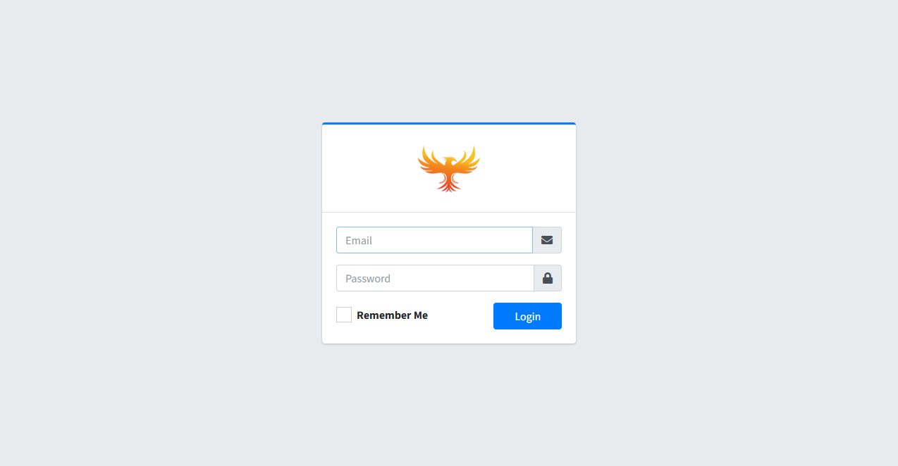
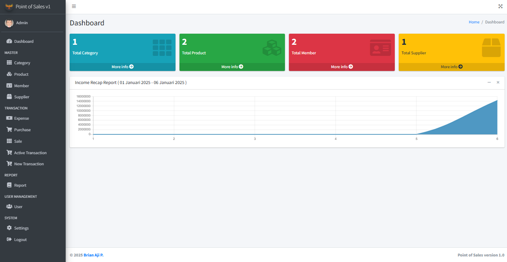
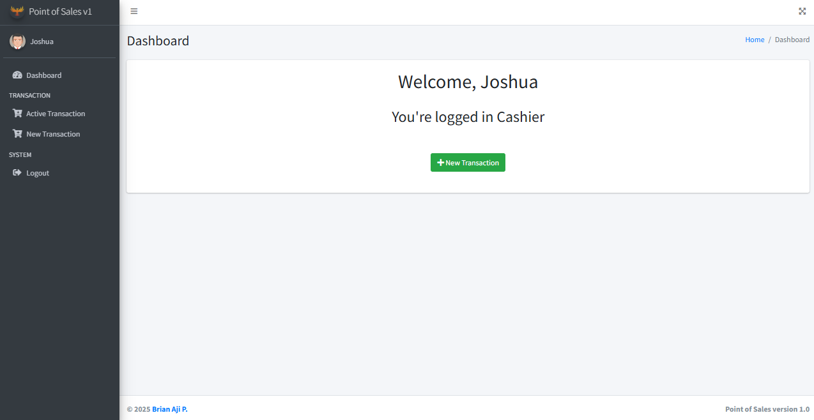
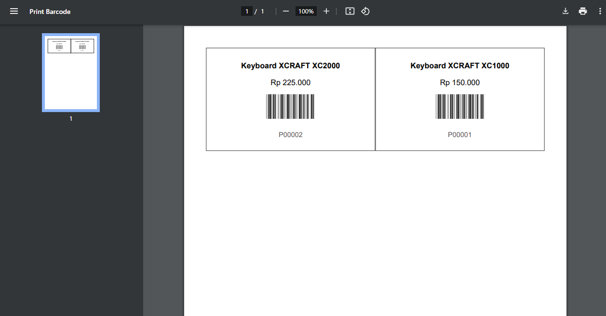
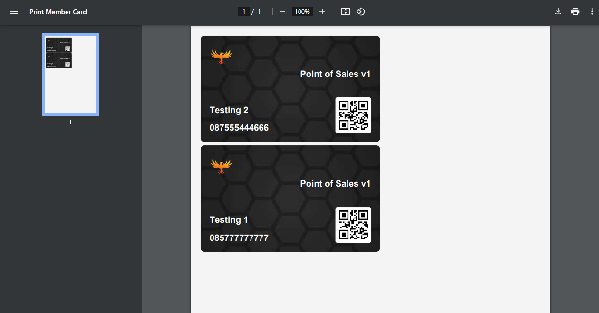
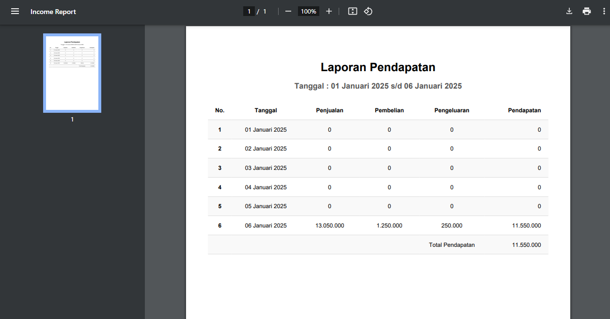

# Point Of Sales v1
This web is still development stage.


## Features

- Role: Admin & Cashier.
- Admin:
  - Dashboard
  - Manage Master Data includes Category, Product (Can Generate/Print Barcode), Member (Can Generate/Print Card Member), and Supplier
  - Manage Transaction: includes Expense, Purchase, Sale, and Transaction (Can Generate/Print Transaction Note)
  - Generate Income Report (Indonesian Version)
  - Manage User and System
- Cashier:
  - Dashboard
  - Add Transaction
  - Generate/Print Transaction Note (Indonesian Version)


## Screenshots

- Login


- Admin Dasboard


- Cashier Dasboard


- Product Barcode


- Card Member


- Income Report (Indonesian Version)



## Prerequisite:

- Composer >= 2.8
- PHP >= 8.3


## Run Locally

Clone the project

```bash
git clone https://github.com/brianajiks123/point-of-sales.git
```

Go to the project directory

```bash
cd point-of-sales
```

Install Dependencies

```bash
composer install
```

Install Packages

```bash
npm install
```

```bash
npm run build
```

Migrate Database (make sure already setup your environment in the .env file)

```bash
php artisan migrate --seed
```

Running Development

```bash
php artisan serve
```


## Login

- Admin:
  - Email: testing@admin.pos.com
  - Password: 12345678
- Cashier: You must create user first


## Tech Stack:

- Frontend: Laravel Jetstream, AdminLTE v3
- Backend: Laravel 11, MySQL, Git, Github


## Acknowledgements

 - [Laravel](https://laravel.com/docs/11.x)
 - [AdminLTE v3](https://github.com/ColorlibHQ/AdminLTE)
 - [YouTube](https://www.youtube.com/@W2Learn)


## Authors

- [@brianajiks123](https://www.github.com/brianajiks123)
